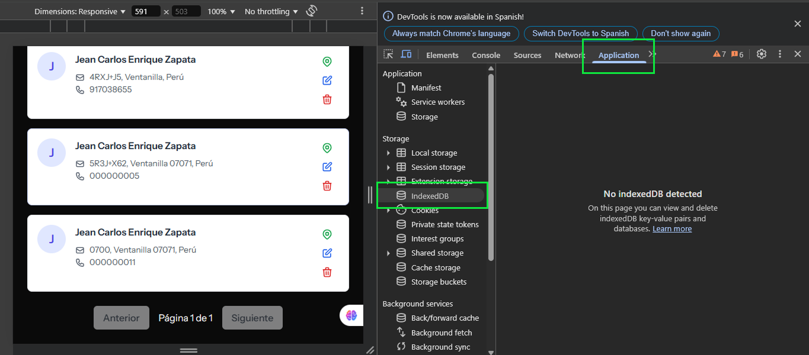

# IndexedDB

IndexedDB es una API de almacenamiento del lado del cliente que permite almacenar grandes cantidades de datos estructurados, incluyendo archivos y blobs. Proporciona capacidades de búsqueda avanzada y es ideal para aplicaciones offline.

## Acceso al panel de IndexedDB

Para inspeccionar y administrar bases de datos IndexedDB:

1. Abre DevTools (F12 o Ctrl+Shift+I / Cmd+Option+I)
2. Navega a la pestaña "Application"
3. Expande la sección "IndexedDB" en el panel lateral izquierdo



## Estructura y componentes

IndexedDB se organiza jerárquicamente:

- **Bases de datos**: Contenedores principales identificados por nombre y versión
- **Object Stores**: Similares a tablas en bases de datos relacionales
- **Índices**: Estructuras para optimizar búsquedas
- **Registros**: Pares clave-valor almacenados en los Object Stores

## Interfaz del panel

El panel de IndexedDB en DevTools ofrece:

### Navegación de bases de datos

- Lista de todas las bases de datos IndexedDB en el origen actual
- Versión de cada base de datos
- Lista de Object Stores en cada base de datos
- Índices definidos para cada Object Store

### Visualización de datos

- Vista tabular de todos los registros en un Object Store
- Valores formateados para tipos comunes (objetos, arrays, fechas)
- Búsqueda y filtrado por valor de clave
- Visualización de metadatos (keyPath, autoIncrement)

## Operaciones disponibles

El panel permite realizar varias acciones:

- **Refresh**: Actualiza la visualización de datos
- **Clear object store**: Elimina todos los registros de un Object Store
- **Delete database**: Elimina completamente una base de datos
- **Edit value**: Modifica el valor de un registro existente (en algunos navegadores)

## Análisis de esquema

Para cada Object Store, puedes examinar:

- **keyPath**: Ruta para extraer la clave del valor (similar a una clave primaria)
- **autoIncrement**: Si las claves se generan automáticamente
- **Índices**: Nombre, keyPath y propiedades (unique, multiEntry)

## Depuración de transacciones

Aunque las transacciones no son directamente visibles en el panel, puedes:

1. Establecer breakpoints en el código de IndexedDB
2. Inspeccionar el estado de transacciones activas durante la depuración
3. Verificar si los cambios se reflejan correctamente en la base de datos

## Límites y consideraciones

| Aspecto | Detalles |
|---------|----------|
| Almacenamiento | Varía según navegador, generalmente con límites más altos que localStorage |
| Rendimiento | Mayor latencia para operaciones pequeñas, óptimo para grandes conjuntos de datos |
| Transacciones | Solo soporta transacciones de corta duración (no persistentes entre recargas) |
| Compatibilidad | Compatible con la mayoría de navegadores modernos |
| Modelo de hilos | Bloqueante en el hilo principal, considerar Workers para operaciones intensivas |

## Patrones comunes y ejemplos

### Estructura básica de código

```javascript
// Abrir o crear una base de datos
const request = indexedDB.open("MyDatabase", 1);

// Manejar la actualización de esquema
request.onupgradeneeded = (event) => {
  const db = event.target.result;
  
  // Crear Object Store con índices
  const store = db.createObjectStore("customers", { keyPath: "id" });
  store.createIndex("name", "name", { unique: false });
  store.createIndex("email", "email", { unique: true });
};

// Operaciones CRUD
request.onsuccess = (event) => {
  const db = event.target.result;
  
  // Ejemplo de transacción de lectura
  const transaction = db.transaction(["customers"], "readonly");
  const store = transaction.objectStore("customers");
  const nameIndex = store.index("name");
  
  // Consulta por índice
  const query = nameIndex.getAll("John");
  
  query.onsuccess = () => {
    console.log(query.result); // Array de customers con name="John"
  };
};
```

## Solución de problemas comunes

| Problema | Solución |
|----------|----------|
| Versión incorrecta | Incrementa el número de versión al modificar el esquema |
| Transacciones abortadas | Verifica errores y maneja excepciones en eventos onerror |
| Problemas de rendimiento | Minimiza el número de transacciones, agrupa operaciones relacionadas |
| Bloqueos | Cierra transacciones lo antes posible para liberar bloqueos |
| Datos no visibles | Actualiza el panel con el botón Refresh tras modificaciones programáticas |

## Buenas prácticas

- Utiliza transacciones con el mínimo alcance necesario
- Implementa manejo adecuado de errores para todas las operaciones
- Diseña un esquema eficiente con índices para consultas frecuentes
- Considera el uso de bibliotecas wrapper para simplificar operaciones (Dexie.js, idb)
- Mantén la lógica de actualización de esquema robusta para manejar migraciones
- Almacena datos serializables (JSON) o utiliza estructuras clonables

IndexedDB es especialmente útil para aplicaciones que necesitan almacenar grandes cantidades de datos estructurados en el cliente, como aplicaciones offline-first, editores de documentos, o cualquier caso que requiera capacidades avanzadas de búsqueda y almacenamiento persistente.