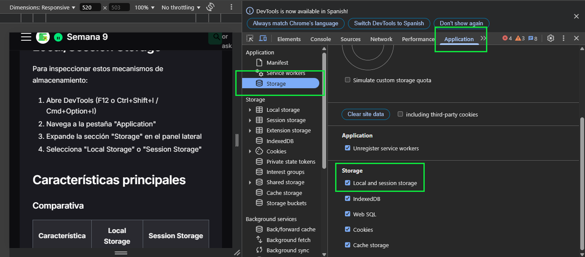

# Local Storage y Session Storage

Local Storage y Session Storage son APIs de almacenamiento web que proporcionan una forma simple y directa de guardar datos en el navegador del usuario mediante pares clave-valor.

## Acceso al panel de Local/Session Storage

Para inspeccionar estos mecanismos de almacenamiento:

1. Abre DevTools (F12 o Ctrl+Shift+I / Cmd+Option+I)
2. Navega a la pestaña "Application"
3. Expande la sección "Storage" en el panel lateral
4. Selecciona "Local Storage" o "Session Storage"



## Características principales

### Comparativa

| Característica | Local Storage | Session Storage |
|----------------|---------------|-----------------|
| Persistencia | Permanente hasta eliminación explícita | Dura solo durante la sesión de navegación |
| Alcance | Por origen (dominio) | Por origen y pestaña/ventana |
| Capacidad | ~5-10MB | ~5-10MB |
| API | Síncrona | Síncrona |
| Compartido entre pestañas | Sí | No |
| Enviado al servidor | No | No |

## Interfaz del panel

Tanto para Local Storage como para Session Storage, la interfaz muestra:

### Tabla de datos

- **Key**: Nombre de la clave
- **Value**: Valor almacenado
- **Size**: Tamaño en bytes

### Controles

- **Refresh**: Actualiza la vista de datos
- **Clear All**: Elimina todos los datos del almacenamiento seleccionado
- **Add new**: Crea un nuevo par clave-valor
- **Delete**: Elimina la entrada seleccionada
- **Filter**: Filtra las entradas por texto

## Uso práctico

### Edición de valores

Para editar un valor existente:

1. Haz doble clic en la celda de valor
2. Edita el contenido
3. Presiona Enter para guardar

### Creación de nuevos items

Para añadir un nuevo par clave-valor:

1. Haz clic derecho en la tabla y selecciona "Add Item" (o usa el botón correspondiente)
2. Introduce la clave y el valor
3. Presiona Enter para guardar

### Eliminación

Para eliminar entradas:

- Selecciona una entrada y presiona el botón Delete o la tecla Delete
- Para eliminar todo, usa el botón "Clear All"

## Inspección de código

El panel muestra el contenido actual, pero para examinar cómo el código interactúa con estos mecanismos:

### Códigos de ejemplo

```javascript
// Almacenar datos
localStorage.setItem('usuario', 'Juan');
sessionStorage.setItem('sesion_id', '12345');

// Recuperar datos
const usuario = localStorage.getItem('usuario');
const sesionId = sessionStorage.getItem('sesion_id');

// Eliminar datos
localStorage.removeItem('usuario');
sessionStorage.clear(); // Elimina todos los datos de sessionStorage
```

### Monitoreo de eventos

Para depurar cambios en el almacenamiento:

```javascript
// Escuchar cambios en localStorage (en otras pestañas/ventanas)
window.addEventListener('storage', (event) => {
  console.log('Cambio en localStorage:', {
    key: event.key,
    oldValue: event.oldValue,
    newValue: event.newValue,
    url: event.url
  });
});
```

> Nota: Este evento solo se dispara para cambios realizados en otras pestañas/ventanas.

## Depuración avanzada

### Puntos de interrupción (Breakpoints)

Para rastrear accesos al almacenamiento:

1. Ve a la pestaña "Sources"
2. En el panel derecho, expande "Event Listener Breakpoints"
3. Marca las casillas bajo "Storage" para pausar la ejecución en operaciones de almacenamiento

### Persistencia entre sesiones

Para simular diferentes escenarios:

- Cierra y vuelve a abrir la pestaña para verificar la persistencia de Local Storage
- Utiliza la característica "Preserve log" en la consola para mantener mensajes entre recargas

## Limitaciones y consideraciones

### Restricciones de tamaño

- El límite típico es de 5-10MB (varía según el navegador)
- No hay notificación estándar cuando se alcanza el límite
- Se debe implementar manejo de errores para casos de sobrecarga

### Tipos de datos

- Solo almacena strings
- Para objetos o arrays, es necesario usar JSON:

```javascript
// Almacenar objeto
const usuario = { nombre: 'Juan', nivel: 3, preferencias: { tema: 'oscuro' }};
localStorage.setItem('usuario_data', JSON.stringify(usuario));

// Recuperar objeto
const usuarioRecuperado = JSON.parse(localStorage.getItem('usuario_data'));
```

### Rendimiento

- Las operaciones son síncronas y bloquean el hilo principal
- Evita operaciones frecuentes o con grandes volúmenes de datos
- Para datos más complejos o voluminosos, considera IndexedDB

## Casos de uso recomendados

Local Storage es ideal para:
- Preferencias de usuario persistentes
- Estado de la aplicación entre sesiones
- Cachés de datos simples y pequeños
- Configuraciones de tema/idioma

Session Storage es ideal para:
- Datos temporales durante una sesión
- Formularios parcialmente completados
- Estado temporal de la interfaz
- Datos sensibles que no deben persistir

## Solución de problemas comunes

| Problema | Solución |
|----------|----------|
| Valor no se actualiza en la interfaz | Usa el botón Refresh para actualizar la vista |
| Error "QuotaExceededError" | Implementa gestión de almacenamiento y limpieza |
| Datos no persisten | Verifica si estás en modo incógnito/privado |
| Valores incorrectos | Revisa la serialización/deserialización JSON |
| Valores compartidos entre pestañas | Usa Session Storage si necesitas aislamiento |

## Mejores prácticas

- Almacena solo datos esenciales para minimizar el uso
- Implementa un sistema de caducidad para limpiar datos antiguos
- Maneja adecuadamente los errores de almacenamiento
- Proporciona alternativas cuando el almacenamiento no está disponible
- Evita almacenar información sensible
- Agrupa datos relacionados en un solo objeto JSON en lugar de múltiples claves
- Utiliza prefijos en las claves para organizar el almacenamiento

```javascript
// Ejemplo de organización con prefijos
localStorage.setItem('app_settings_theme', 'dark');
localStorage.setItem('app_settings_language', 'es');
localStorage.setItem('app_user_id', '12345');
localStorage.setItem('app_user_name', 'Juan');
```

La utilización efectiva de Local Storage y Session Storage puede mejorar significativamente la experiencia del usuario al proporcionar persistencia de datos y reducir la necesidad de comunicación con el servidor para información que se puede mantener localmente.