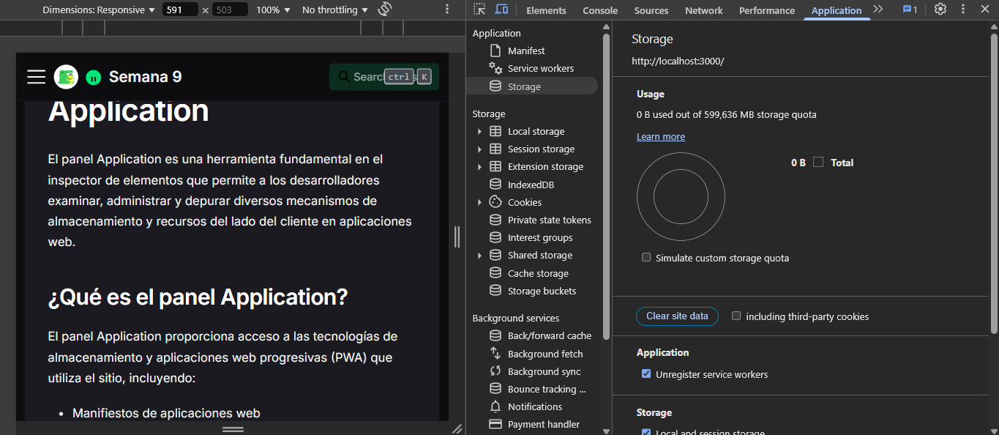

# Almacenamiento Web (Storage)

El almacenamiento web permite a las aplicaciones guardar datos localmente en el dispositivo del usuario. El panel Application proporciona herramientas para inspeccionar y gestionar todos los mecanismos de almacenamiento disponibles.

## Acceso al panel de Storage

Para acceder a las opciones de almacenamiento:

1. Abre DevTools (F12 o Ctrl+Shift+I / Cmd+Option+I)
2. Navega a la pestaña "Application"
3. Expande la sección "Storage" en el panel lateral izquierdo



## Tipos de almacenamiento

El panel ofrece herramientas para los siguientes mecanismos:

| Mecanismo | Capacidad | Persistencia | API | Uso recomendado |
|-----------|-----------|--------------|-----|-----------------|
| Local Storage | ~5-10MB | Permanente | Síncrona | Datos pequeños, persistencia a largo plazo |
| Session Storage | ~5-10MB | Sesión | Síncrona | Datos temporales durante una sesión |
| IndexedDB | Cuota disponible* | Permanente | Asíncrona | Grandes cantidades de datos estructurados |
| Cache Storage | Cuota disponible* | Permanente | Asíncrona | Recursos de red para funcionamiento offline |
| Cookies | ~4KB por cookie | Configurable | Síncrona | Datos entre cliente-servidor, autenticación |
| Web SQL | Obsoleto | Permanente | Asíncrona | **No recomendado para uso nuevo** |

*La cuota disponible varía según el navegador y espacio disponible, generalmente varios cientos de MB o más.

## Local Storage

Almacenamiento simple clave-valor que persiste después de cerrar el navegador:

### Vista del panel

- Tabla de pares clave-valor
- Tamaño de cada valor almacenado
- Opciones para editar, eliminar, crear valores

### Acciones disponibles

- **Refresh**: Actualiza la vista de datos almacenados
- **Clear All**: Elimina todos los datos de Local Storage
- **Delete Selected**: Elimina entradas seleccionadas
- **Create Item**: Añade nuevos pares clave-valor

## Session Storage

Similar a Local Storage pero limitado a la duración de la sesión:

- Misma interfaz que Local Storage
- Los datos se eliminan al cerrar la pestaña/ventana
- Aislado por origen y pestaña

## Cookies

Pequeños fragmentos de datos enviados al servidor con cada solicitud:

- Tabla con todas las cookies del sitio
- Información detallada (expiración, dominios, flags)
- Opciones de seguridad (HttpOnly, Secure, SameSite)

## IndexedDB

Base de datos NoSQL en el cliente para grandes cantidades de datos estructurados:

- Explorador de bases de datos, object stores e índices
- Visualización de registros almacenados
- Funcionalidades para crear, editar y eliminar datos

## Cache Storage

Almacenamiento para recursos de red usado por Service Workers:

- Lista de cachés disponibles
- Recursos almacenados en cada caché
- Opciones para eliminar cachés o entradas individuales

## Uso del panel Storage

### Inspección de datos

Para examinar datos almacenados:

1. Selecciona el tipo de almacenamiento en el panel lateral
2. Navega por las entradas disponibles
3. Selecciona entradas específicas para ver detalles completos
4. Utiliza filtros para buscar datos específicos (cuando esté disponible)

### Manipulación de datos

El panel permite:

- Añadir nuevos valores en tiempo real
- Editar valores existentes
- Eliminar entradas individuales o limpiar todo el almacenamiento
- Monitorear cambios realizados por scripts

## Análisis de uso de almacenamiento

### Storage Usage

En algunos navegadores, el panel incluye una vista general del uso:

- Distribución del almacenamiento por tipo
- Cuota total disponible vs utilizada
- Estimación de espacio restante

### Persistencia

Verificación del estado de persistencia:

```javascript
// Código que se puede probar desde la consola
if (navigator.storage && navigator.storage.persisted) {
  navigator.storage.persisted().then(isPersisted => {
    console.log(`Persistencia: ${isPersisted ? 'concedida' : 'no concedida'}`);
  });
}
```

## Clear Site Data

La función unificada para limpiar datos:

- Permite seleccionar qué tipos de almacenamiento limpiar
- Opción para eliminar todos los datos del sitio
- Útil para pruebas o solución de problemas

## Límites y consideraciones

### Cuotas de almacenamiento

- Local Storage y Session Storage: Típicamente 5-10MB
- IndexedDB y Cache: Cuota compartida, generalmente varios cientos de MB
- El navegador puede solicitar permiso para más almacenamiento

### Persistencia

- El almacenamiento puede ser eliminado por:
  - Acciones explícitas del usuario
  - Herramientas de limpieza del navegador
  - Modo incógnito/privado
  - Políticas de gestión de almacenamiento del navegador

### Rendimiento

- Local Storage y Session Storage: Operaciones síncronas que pueden bloquear el hilo principal
- IndexedDB y Cache API: Operaciones asíncronas con mejor rendimiento
- Cookies: Enviadas en cada solicitud, impactando el rendimiento de la red

## Solución de problemas comunes

| Problema | Solución |
|----------|----------|
| Datos no persisten | Verifica si el navegador está en modo privado |
| Cuota excedida | Implementa manejo de errores para casos de almacenamiento lleno |
| Rendimiento lento | Minimiza operaciones síncronas, usa Workers para operaciones intensivas |
| Datos obsoletos | Actualiza la vista con la opción Refresh |
| Problemas de sincronización | Implementa un sistema de versiones para los datos |

## Mejores prácticas

- Utiliza el tipo de almacenamiento adecuado para cada caso de uso
- Implementa un sistema de gestión de cuotas y limpieza
- Maneja adecuadamente los errores de almacenamiento
- Considera la navegación privada/incógnito al diseñar la aplicación
- Proporciona alternativas cuando el almacenamiento no está disponible
- Minimiza el tamaño de los datos almacenados

El panel Storage en DevTools es esencial para desarrollar aplicaciones web que utilicen eficientemente el almacenamiento local, permitiendo depurar problemas, optimizar el uso del almacenamiento y garantizar una experiencia de usuario fluida incluso en condiciones offline.