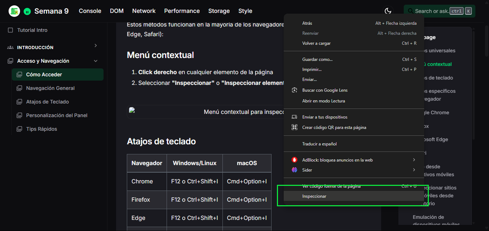

# Cómo Acceder al Inspector de Elementos

Existen múltiples formas de acceder al Inspector de Elementos en los distintos navegadores. Conocer todos estos métodos te permitirá elegir el más conveniente según tu flujo de trabajo.

## Métodos universales

Estos métodos funcionan en la mayoría de los navegadores modernos (Chrome, Firefox, Edge, Safari):

### Menú contextual

1. **Click derecho** en cualquier elemento de la página
2. Seleccionar **"Inspeccionar"** o **"Inspeccionar elemento"** en el menú desplegable

### Atajos de teclado

| Navegador | Windows/Linux | macOS |
|-----------|--------------|-------|
| Chrome    | F12 o Ctrl+Shift+I | Cmd+Option+I |
| Firefox   | F12 o Ctrl+Shift+I | Cmd+Option+I |
| Edge      | F12 o Ctrl+Shift+I | Cmd+Option+I |
| Safari    | No disponible | Cmd+Option+I |

## Métodos específicos por navegador

### Google Chrome

**Desde el menú principal:**
1. Haz clic en los tres puntos verticales en la esquina superior derecha
2. Selecciona **"Más herramientas"**
3. Elige **"Herramientas para desarrolladores"**

**Selector de elementos:**
1. Presiona **Ctrl+Shift+C** (Windows/Linux) o **Cmd+Shift+C** (macOS)
2. Haz clic en cualquier elemento de la página

### Firefox

**Desde el menú principal:**
1. Haz clic en el icono de hamburguesa (tres líneas horizontales)
2. Selecciona **"Más herramientas"**
3. Elige **"Herramientas para desarrolladores web"**

**Inspector de forma directa:**
1. Presiona **Ctrl+Shift+C** (Windows/Linux) o **Cmd+Shift+C** (macOS)
2. Haz clic en cualquier elemento

### Microsoft Edge

**Desde el menú principal:**
1. Haz clic en los tres puntos horizontales en la esquina superior derecha
2. Selecciona **"Más herramientas"**
3. Elige **"Herramientas para desarrolladores"**

### Safari

**Habilitar herramientas de desarrollo:**
1. Ve a **"Safari"** > **"Preferencias"**
2. Selecciona la pestaña **"Avanzado"**
3. Marca la casilla **"Mostrar menú Desarrollo en la barra de menús"**

**Acceder al Inspector:**
1. Desde el menú **"Desarrollo"** en la barra de menús
2. Selecciona **"Mostrar Inspector Web"**
3. O usa el atajo **Cmd+Option+I**

## Acceso desde dispositivos móviles

### Inspeccionar sitios en móviles desde escritorio

**Chrome / Edge (para Android):**
1. Conecta tu dispositivo Android al ordenador mediante USB
2. Habilita la depuración USB en tu dispositivo Android
3. En el navegador de escritorio, navega a `chrome://inspect`
4. Selecciona tu dispositivo y la página que deseas inspeccionar

**Safari (para iOS):**
1. Conecta tu dispositivo iOS al Mac
2. En Safari (Mac), ve al menú **"Desarrollo"**
3. Selecciona tu dispositivo iOS
4. Elige la página web que deseas inspeccionar

### Emulación de dispositivos móviles

Todos los navegadores principales ofrecen opciones para emular dispositivos móviles:

1. Abre las DevTools
2. Activa el modo de dispositivo:
   - Chrome/Edge: Haz clic en el icono de dispositivo móvil
   - Firefox: Haz clic en el icono "Diseño adaptable"
   - Safari: Selecciona "Entrar en modo adaptable" desde el menú Desarrollo

## Solución de problemas comunes

### No aparece la opción "Inspeccionar"
- Verifica que no estés en una página interna del navegador (como chrome://settings)
- Algunos sitios web pueden bloquear el menú contextual
- Prueba usando los atajos de teclado en su lugar

### Herramientas de desarrollo deshabilitadas
- En entornos corporativos, las DevTools pueden estar restringidas
- En Safari, asegúrate de haber habilitado el menú Desarrollo
- En Chrome, verifica que no haya políticas que restrinjan el acceso

### Inspector abre pero no muestra el elemento correcto
- Utiliza el selector de elementos (icono de cursor) en las DevTools
- Navega manualmente por la estructura DOM hasta encontrar el elemento
- Utiliza la búsqueda (Ctrl+F / Cmd+F dentro de las DevTools) para localizar elementos por selector o texto

## Identificación visual

Una vez abierto el Inspector, sabrás que estás en el panel correcto cuando veas:

- La estructura jerárquica HTML (árbol DOM) en el panel izquierdo
- La información de estilos CSS en el panel derecho o inferior
- Resaltado de elementos al pasar el cursor por encima del código HTML

En la siguiente sección, aprenderás cómo navegar eficientemente por el Inspector de Elementos una vez que hayas accedido a él.