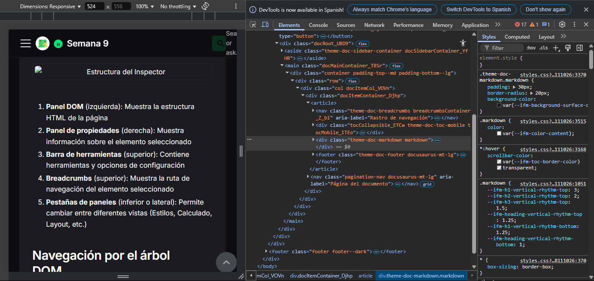

import DocsCard from '/src/components/global/DocsCard';
import DocsCards from '/src/components/global/DocsCards';

# Navegación General en el Inspector de Elementos

Una vez que has accedido al Inspector de Elementos, es esencial familiarizarse con su interfaz y aprender a navegar eficientemente entre sus diferentes componentes. Esta sección te guiará a través de la estructura general del Inspector y cómo moverte por él.

## Estructura básica del Inspector

El Inspector de Elementos se divide típicamente en varias áreas principales:

1. **Panel DOM** (izquierda): Muestra la estructura HTML de la página
2. **Panel de propiedades** (derecha): Muestra información sobre el elemento seleccionado
3. **Barra de herramientas** (superior): Contiene herramientas y opciones de configuración
4. **Breadcrumbs** (superior): Muestra la ruta de navegación del elemento seleccionado
5. **Pestañas de paneles** (inferior o lateral): Permite cambiar entre diferentes vistas (Estilos, Calculado, Layout, etc.)

## Navegación por el árbol DOM

### Selección de elementos

<DocsCards>
  <DocsCard header="Selección directa" href="/acceso-navegacion/navegacion-general#seleccion-directa">
    
Distintas formas de seleccionar elementos en la página.

  </DocsCard>
  <DocsCard header="Navegación por teclado" href="/acceso-navegacion/navegacion-general#navegacion-teclado">
    
Moverte por el DOM usando atajos de teclado.

  </DocsCard>
</DocsCards>

#### Selección directa {#seleccion-directa}

Para seleccionar un elemento en la página:

1. **Usando el selector de elementos**:
   - Haz clic en el icono de selector (🔍) en la barra de herramientas
   - Haz clic en cualquier elemento visible en la página
   - El elemento se seleccionará en el panel DOM

2. **Desde el árbol DOM**:
   - Navega por la estructura jerárquica en el panel izquierdo
   - Haz clic en el elemento que deseas inspeccionar
   - El elemento se resaltará en la página

#### Navegación por teclado {#navegacion-teclado}

Una vez que tengas un elemento seleccionado en el panel DOM:

- **Flechas arriba/abajo**: Moverse al elemento anterior/siguiente en el mismo nivel
- **Flechas izquierda/derecha**: Colapsar/expandir elementos con hijos o moverse al padre/primer hijo
- **Tab**: Moverse entre el panel DOM y el panel de propiedades
- **Enter**: Activar edición del elemento seleccionado

### Búsqueda en el DOM

Para encontrar elementos específicos:

1. **Búsqueda por selector o texto**:
   - Presiona Ctrl+F (Windows/Linux) o Cmd+F (macOS)
   - Introduce un selector CSS (ej. `.clase`, `#id`) o texto contenido en el elemento
   - Usa las flechas para navegar entre los resultados encontrados

2. **Búsqueda avanzada**:
   - En Chrome/Edge: Presiona Ctrl+Shift+F para búsqueda global
   - Busca en todos los recursos, no solo en el DOM

## Exploración de paneles

### Panel DOM

El panel principal que muestra la estructura HTML:

- **Colapsar/expandir nodos**: Haz clic en las flechas junto a los elementos con hijos
- **Editar atributos**: Haz doble clic en un atributo para modificarlo
- **Editar contenido**: Haz doble clic en el contenido de texto para editarlo
- **Reorganizar elementos**: Arrastra y suelta elementos para cambiar su posición (no disponible en todos los navegadores)

### Panel de estilos

Para trabajar con CSS:

- **Ver reglas aplicadas**: Las reglas se muestran en orden de especificidad
- **Editar propiedades**: Haz clic en los valores para modificarlos
- **Añadir nuevas propiedades**: Haz clic en el espacio vacío dentro de un bloque
- **Activar/desactivar propiedades**: Haz clic en las casillas de verificación
- **Filtrar propiedades**: Usa el campo de búsqueda (filtro) para encontrar propiedades específicas

### Panel calculado

Para ver los valores CSS finales:

- **Filtrar por propiedad**: Escribe en el campo de búsqueda
- **Ver origen de valores**: Haz clic en los enlaces para ir a la regla de origen
- **Navegar por categorías**: Expande o colapsa secciones para organizar la vista

### Panel de layout

Para trabajar con el modelo de caja y layouts:

- **Modelo de caja**: Visualiza y edita margin, border, padding y dimensiones
- **Flexbox**: Inspecciona propiedades y comportamiento de contenedores flex
- **Grid**: Visualiza y modifica estructuras de cuadrícula

## Navegación entre pestañas

Los paneles adicionales varían según el navegador, pero generalmente incluyen:

- **Estilos**: Vista predeterminada para propiedades CSS
- **Calculado**: Valores CSS finales después de aplicar la cascada
- **Layout**: Herramientas visuales para modelo de caja, flexbox y grid
- **Fuentes**: Información sobre tipografías en uso
- **Eventos**: Listeners de eventos asociados al elemento
- **DOM Breakpoints**: Puntos de interrupción para depuración
- **Properties**: Propiedades JavaScript del objeto DOM

## Navegación entre herramientas de desarrollador

Para cambiar entre diferentes herramientas de desarrollo:

1. **Usando las pestañas superiores**:
   - Elements/Inspector: DOM y estilos
   - Console: Consola JavaScript
   - Network: Red y peticiones
   - Performance: Rendimiento
   - Sources/Debugger: Código fuente y depuración

2. **Atajos rápidos**:
   - Ctrl+Shift+C (Cmd+Shift+C): Selector de elementos
   - Ctrl+Shift+J (Cmd+Option+J): Consola
   - Ctrl+Shift+I (Cmd+Option+I): Última herramienta utilizada

## Navegación múltiple

Para trabajar con varias partes de la página:

- **Desacoplar en ventana separada**: Haz clic en el icono de opciones (⋮) y selecciona "Dock side" > "Undock into separate window"
- **Organizar paneles**: Arrastra las pestañas para reorganizar la interfaz
- **Múltiples selecciones**: En algunos navegadores, puedes mantener un historial de elementos seleccionados

## Uso de breadcrumbs

La barra de migas de pan (breadcrumbs) proporciona una forma eficiente de navegar:

- **Ver jerarquía**: Muestra la ruta desde el elemento html hasta el elemento seleccionado
- **Navegación rápida**: Haz clic en cualquier elemento de la ruta para seleccionarlo
- **Visualización de contexto**: Facilita entender dónde se encuentra un elemento

## Consejos de navegación avanzada

- **Hover sobre elementos**: Pasa el cursor sobre un elemento en el panel DOM para resaltarlo en la página
- **Preservar estado**: Utiliza el icono de "Preserve log" para mantener la información entre recargas
- **Ocultar nodos**: Puedes ocultar nodos del DOM haciendo clic derecho y seleccionando "Hide element"
- **Expandir todos los nodos**: Haz clic derecho en un nodo padre y selecciona "Expand recursively"

Dominar la navegación por el Inspector de Elementos te ahorrará tiempo y hará que tu trabajo de desarrollo sea más eficiente. En la siguiente sección, exploraremos los atajos de teclado que pueden acelerar aún más tu flujo de trabajo.