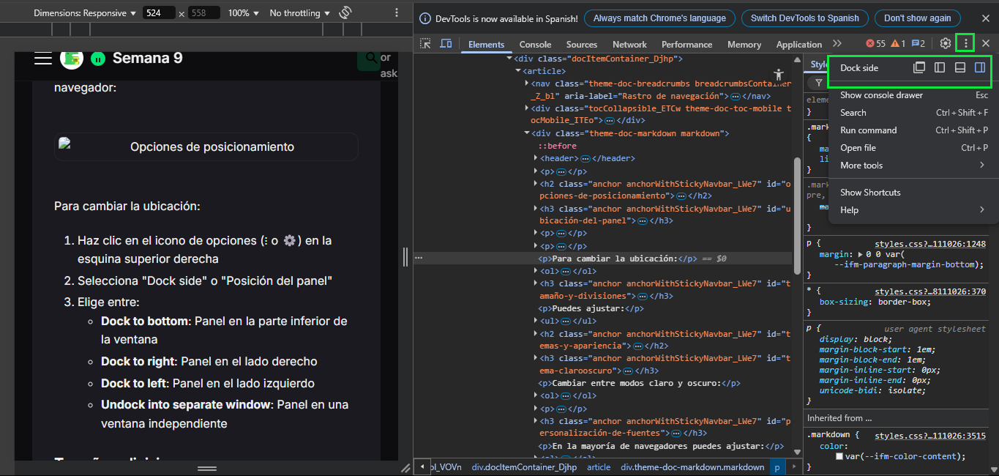
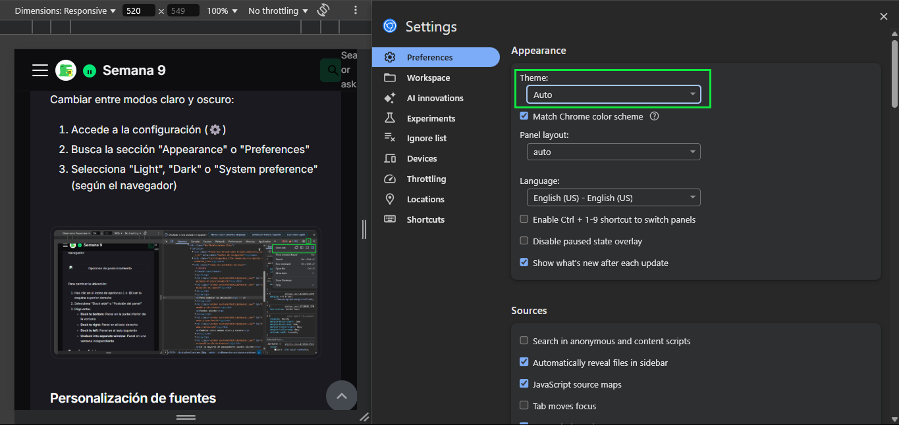

# Personalización del Panel del Inspector

El Inspector de Elementos ofrece diversas opciones de personalización que te permiten adaptar la interfaz a tus necesidades específicas. Personalizar tu entorno de trabajo te ayudará a ser más eficiente y a enfocarte en las tareas que son importantes para tu flujo de desarrollo.

## Opciones de posicionamiento

### Ubicación del panel

La primera forma de personalizar el Inspector es ajustar su posición en relación con la ventana del navegador:

Para cambiar la ubicación:
1. Haz clic en el icono de opciones (⋮ o ⚙️) en la esquina superior derecha
2. Selecciona "Dock side" o "Posición del panel"
3. Elige entre:
   - **Dock to bottom**: Panel en la parte inferior de la ventana
   - **Dock to right**: Panel en el lado derecho
   - **Dock to left**: Panel en el lado izquierdo
   - **Undock into separate window**: Panel en una ventana independiente

### Tamaño y divisiones

Puedes ajustar:
- **Tamaño general**: Arrastra los bordes del panel para redimensionarlo
- **Divisiones internas**: Modifica la proporción entre paneles arrastrando los separadores

## Temas y apariencia

### Tema claro/oscuro

Cambiar entre modos claro y oscuro:

1. Accede a la configuración (⚙️)
2. Busca la sección "Theme" o "Tema"
3. Selecciona "Light", "Dark" o "System preference" (según el navegador)

### Personalización de fuentes

En la mayoría de navegadores puedes ajustar:

1. **Tamaño de fuente**:
   - Chrome/Edge: Settings > Preferences > Appearance > Font size
   - Firefox: Settings > General > Font size
   - Safari: Preferences > Advanced > Accessibility

2. **Familia tipográfica**:
   - Principalmente para paneles de código (varía según navegador)
   - Busca opciones como "Editor font" o "Font family"

## Paneles y secciones

### Reordenar pestañas

Para adaptar el orden de las pestañas a tu flujo de trabajo:

1. Mantén presionado y arrastra las pestañas principales
2. Suelta en la posición deseada

### Mostrar/ocultar paneles

Personaliza qué paneles están visibles:

1. Haz clic derecho en la barra de pestañas
2. Selecciona o deselecciona los paneles que deseas mostrar u ocultar
3. También puedes usar el menú "More tabs" (») para acceder a paneles ocultos

### Paneles adicionales (Drawer)

El área inferior adicional (Drawer) puede mostrar diferentes paneles:

1. Presiona Esc para mostrar/ocultar
2. Haz clic en el icono de opciones (⋮) dentro del drawer
3. Selecciona qué panel quieres mostrar:
   - Console
   - Animations
   - Network conditions
   - Performance monitor
   - Rendering
   - Entre otros...

## Configuración específica del Inspector

### Opciones de visualización DOM

Personaliza cómo se muestra el árbol DOM:

1. Ve a Settings > Preferences > Elements
2. Ajusta opciones como:
   - **Show user agent shadow DOM**: Muestra/oculta el DOM en sombra
   - **Word wrap**: Ajusta si el contenido del DOM se envuelve en líneas largas
   - **Highlight updates**: Resalta actualizaciones dinámicas en el DOM

### Configuración de accesibilidad

1. Ve a Settings > Preferences > Accessibility
2. Ajusta opciones como:
   - **Enable screen reader support**: Mejora la compatibilidad con lectores de pantalla
   - **Focus outlines**: Resalta elementos enfocados para navegación con teclado

Con estas opciones, puedes personalizar el Inspector de Elementos para que se adapte mejor a tus necesidades y flujo de trabajo.