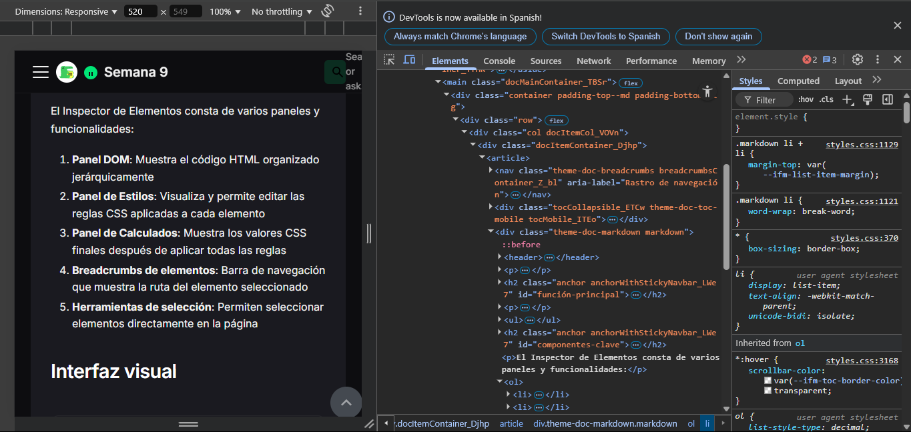

# ¿Qué es el Inspector de Elementos?

El Inspector de Elementos es una herramienta fundamental de las DevTools (herramientas para desarrolladores) que permite visualizar, analizar y modificar en tiempo real el código HTML, CSS y estructura DOM de cualquier página web.

## Función principal

El Inspector de Elementos actúa como una lupa que te permite examinar todos los componentes que forman una página web:

- **Visualización del DOM**: Muestra la estructura de árbol jerárquico de los elementos HTML
- **Inspección de estilos**: Permite ver y modificar temporalmente las propiedades CSS aplicadas
- **Manipulación en directo**: Facilita realizar cambios y ver resultados instantáneamente
- **Depuración visual**: Ayuda a identificar problemas de estructura y presentación

## Componentes clave

El Inspector de Elementos consta de varios paneles y funcionalidades:

1. **Panel DOM**: Muestra el código HTML organizado jerárquicamente
2. **Panel de Estilos**: Visualiza y permite editar las reglas CSS aplicadas a cada elemento
3. **Panel de Calculados**: Muestra los valores CSS finales después de aplicar todas las reglas
4. **Breadcrumbs de elementos**: Barra de navegación que muestra la ruta del elemento seleccionado
5. **Herramientas de selección**: Permiten seleccionar elementos directamente en la página

## Interfaz visual

*El panel del Inspector de Elementos mostrando la estructura DOM y las propiedades CSS*

## Disponibilidad

El Inspector de Elementos está disponible en todos los navegadores modernos:

- **Chrome**: F12 o Click derecho > Inspeccionar
- **Firefox**: F12 o Click derecho > Inspeccionar
- **Safari**: Habilitar en Preferencias > Avanzado > "Mostrar menú de desarrollo" y luego Desarrollador > Mostrar Inspector Web
- **Edge**: F12 o Click derecho > Inspeccionar

En la siguiente sección exploraremos las diferentes herramientas disponibles dentro del Inspector de Elementos y cómo utilizarlas eficientemente.