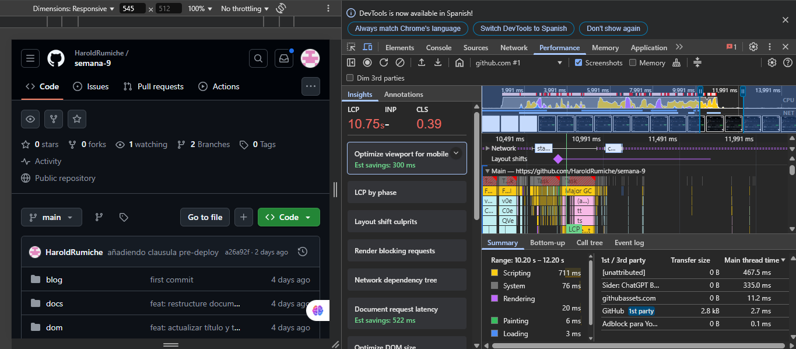

# Monitor de FPS (Frames Por Segundo)

El monitor de FPS (Frames Por Segundo) en el panel Performance es una herramienta fundamental para evaluar la fluidez y capacidad de respuesta visual de tu aplicación web.

## ¿Qué son los FPS?

Los frames por segundo representan cuántas imágenes (frames) puede renderizar el navegador en un segundo. Para experiencias web fluidas:

- **60 FPS**: Ideal para la mayoría de interacciones web y animaciones suaves
- **30 FPS**: Mínimo aceptable para contenido interactivo básico
- **< 30 FPS**: Perceptible como lento o entrecortado para los usuarios

## Análisis del gráfico de FPS

En el panel Performance, el gráfico de FPS se muestra en la parte superior de la grabación:

### Elementos clave:

- **Barra verde**: Altura indica el FPS (más alto = mejor rendimiento)
- **Barras rojas**: Indican caídas de rendimiento y posibles jank (saltos visuales)
- **Línea de 60 FPS**: Referencia para rendimiento óptimo

## Identificación de problemas comunes

### 1. Jank (saltos visuales)

El jank ocurre cuando hay inconsistencias en los tiempos de frame, causando un efecto visual entrecortado:

- **Causa**: Frames que tardan más de 16.7ms (1000ms ÷ 60fps) en procesarse
- **Identificación**: Barras rojas o verdes irregulares en el gráfico FPS
- **Solución**: Analizar qué tareas bloquean el hilo principal durante estos frames

### 2. Animaciones lentas

- **Causa**: Operaciones de layout o paint costosas durante animaciones
- **Identificación**: Secuencias prolongadas de FPS por debajo de 60
- **Solución**: Usar propiedades que solo afecten a composite (opacity, transform)

## Herramientas relacionadas

### Frame Viewer

Para analizar frames individuales:

1. Selecciona un frame específico en el gráfico FPS
2. Observa en la sección "Frames" los detalles de cada frame
3. Identifica qué actividades (JS, Layout, Paint) consumen más tiempo

### Estadísticas de Rendering

En la pestaña "Rendering" del panel Performance:

1. Activa la opción "Frame Rendering Stats" 
2. Obtén información en tiempo real sobre:
   - FPS actual
   - GPU memoria usada
   - Recuentos de nodos DOM y layers

## Optimización basada en FPS

Para mejorar tus métricas de FPS:

1. **Minimiza operaciones de layout**: Evita leer propiedades que causen reflow
2. **Reduce complejidad visual**: Simplifica estilos y animaciones en elementos clave
3. **Utiliza GPU acceleration**: Aprovecha transform y opacity para animaciones
4. **Implementa throttling/debouncing**: Limita funciones que se ejecutan durante scroll o resize
5. **Considera Web Workers**: Desplaza trabajo pesado fuera del hilo principal

## Conclusión

El monitor de FPS es una herramienta diagnóstica esencial para desarrolladores web enfocados en rendimiento. Un análisis regular te ayudará a mantener animaciones fluidas y una experiencia de usuario óptima en tu aplicación web.